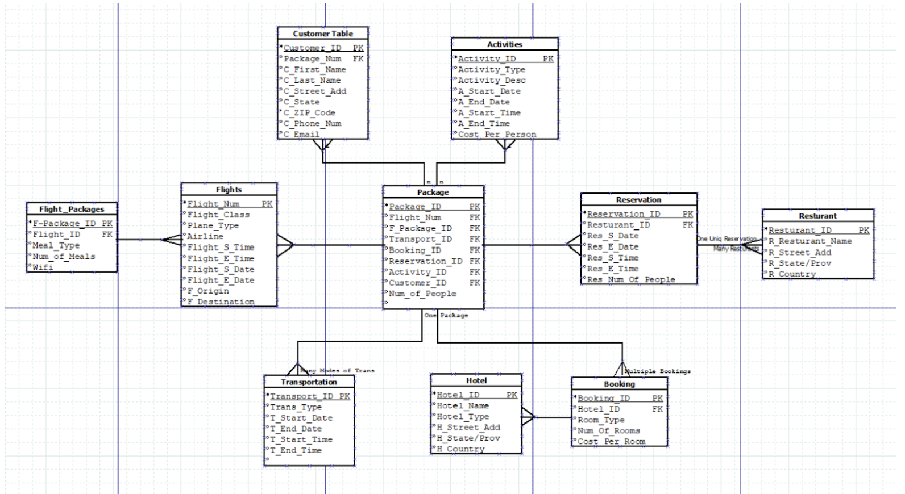

What is being done?

This project is the creation of a database and application that allows users to access data about vacation accommodations, enter personal information into the database, and generate an order for a vacation package. The database will contain entity tables for customers, packages, flights, transportation, hotels, activities, and other important aspects of booking a vacation. When using the application, users will be able to make queries to access rows of data that fit criteria that they enter. Some examples of criteria that can be entered are upper and lower bounds on price, date, and location. Once the user is done looking at the data, they will be able to generate an order for a vacation package in the form of an invoice, which will contain all relevant information about what is being purchased.

How is it being done?

For this project, an application and database are being designed and built by a small team of developers. The first thing the team addressed was what the database will need to store data about. The developers are creating entity- relationship diagrams and dependency diagrams in order to ensure that all necessary data will be stored and normalized. Once the entities are properly planned, they will be built and populated with sample data, and then tested to ensure that the data is correct and the data tables are structured properly. The implementation and testing of the database will be done using Oracle Application Express software, and this software will also be used by the clients to access the data. Once the developers are sure that the tables are built correctly, they will develop an app that will allow users to access and submit the data they need to book a vacation, and test the application once it is done. The application will be accessible on a personal computer that has access to Oracle software.

Who is doing it?
A group of developers are working together to create an application and build a database for the vacation booking system. The developers start by designing the database structure using diagrams like entity relationship diagrams and implement the database structure using the diagrams. Next, the database will be implemented using the Oracle application express. This includes creating a table adding sample data and testing the data entered. Furthermore, the developers build an application which is interactive and used for importing information and ordering personalized vacation packages. The team collectively puts an effort into creating a functional and robust vacation booking system. The developers communicate different ideas and work together to ensure the successful implementation of this system. Each role contributes uniquely to the overall success of the project that is tailored to the individual needs of the customer.

When is it being done? 
During the first week, the project begins with brainstorming and assignment of roles. It also involves a detailed discussion of the project scope and basic application functionalities. Next, during week two, the database planning and design take place. Creating the entity relationship diagram, understanding the relationships between entities, and finalizing the database structure also take place during week two, which is due by  the 29th of November 2023. Next, in week three, the tables are created, and the data is populated. Next, the testing of the data populated is conducted and refinements are made after testing the data.The implementation is due by December 5, 2023.Moving forward, progressive developments are made as continual testing of the project takes place. Towards the end of the project, system validation functionality is tested. Validating the input of the user and testing the seamless experience based on the user perspective also takes place towards the end. Any last-minute enhancements are also made during this stage. Next, the system is ready to be used by the users. It is accompanied by a presentation showcasing the functional vacation booking system created by the team of student developers. The presentation contents will be created with all the information by the deadline of December 7th 2023. The presentation will be presented by the student developers in front of the class and the instructor explaining the project. This is due by the 12th of December 2023.

Why is it being done?
The app for vacation booking is created to make it easier for people to plan their trips. It also enables people to create a personalized package for their vacation without any hassle. With this app, people can share their vacation packages with their friends or family. It is all about creating an effortless and personalized experience for each person on their vacation. Moreover, it also allows the student developers to build a database and create an app for a purpose. It is more like a hands-on project to help the student developers learn about the databases and how they interact in real projects. It also enables the student developers to enhance their skills and makes it easier to interact and work in teams and present the project to other students. It is also a way to learn the complexities of creating a functional database system. This version maintains a focus on user convenience while emphasizing the educational significance for student developers.

 
How can it be improved? 
The vacation booking system can have many exciting possibilities that would enrich the user experience overall. One such improvement could be integrating interactive maps. This would offer a huge possibility for visual exploration of destinations and attractions. Another such possibility would be the inclusion of personalized travel guides based on user preferences and destinations. Users would be assigned certain travel guides based on their data and travel history. Moreover, integrating AI-powered chatbots could also provide instant chat assistance and answer frequently asked questions. It would also be a huge help to guide users throughout their booking process and give them suggestions from time to time. The app can also be improved by providing information about the environmental impact of travel and carbon footprint estimates which would promote mindful traveling and spread awareness. Lastly, the most important feature that should be added soon would be language translation services. It would assist people to communicate in foreign countries by using real-time language translation features which would enhance their experience of socializing during their vacation.

